# [Datakom for ingeniører - Eksamensøving](https://sites.google.com/view/tdat2004-datakom/)

# **Lagmodellen**

- Basert på forenklede 5-lags OSI-modellen

```
Netverksprogram

<->

Applikasjonslaget
Transportlaget
Nettverkslaget
Lenkelaget
Fysisk lag
```


---

## Om Lagmodellen
- Utviklet for å dele opp en kompleks oppgave i separate deloppgaver, organisert i "lag".
- Modellen er utviklet av `ISO` og kalles Open Systems Interconnection (`OSI`) modellen.
- Andre standardiseringsorganisasjoner er `IETF`, `IEEE` og `W3C`.

*Det er flere utgaver av modellen, bla. 7-lags OSI-modellen og en TCO/IP-modell. Men vi benytter den forenklede modellen*

### Beskrivelse

1. #### Hovedprinsipper.
Systemutviklere har ansvar for å utvikle  i henhold til grensesnitt mot protokoller på applikasjonslaget. Prinsipper er at apps og protokoller kommuniserer med hverandre på likestilt nivå, men benytter tjenerter fra laget under for å overføre data mellom partene. Ved en slik approach kan man bytte ut en protokoll (eller blokk/modul) uten å påvirke andre deler av systemet. Hver blokk/modul er en tjeneste.


2. #### Oppagene for lagene.
- Applikasjonslaget: Grensesnitt mot distrubuerte applikasjoner. *Eksempler er HTTP, SMTP (e-post), FTP (filoverføring)*
- Transportlaget: Ende-ende overføring av meldinger. *Eksempler er TCP (Transport Control Protocol) og UDP (User Datagram Protocol)*
- Nettverkslaget: Sørger for at hver pakke rutes gjennom nettet. *Eksempler er IP (Internet Protocol) og ICMP (Internet Control Message Protocol)*
- Lenkelaget: Sørger for at pakkene overføres mellom to tilstøtende noder (mellom to nettverkskort). *Eksempler er Ethernet og Wi-Fi*
- Fysisk lag: Sender signaler over et transmisjonsmedium (luft, kopper, fiber). *Eksempler er elektriske signaler, optiske signaler og radiobølger.*

3. #### Pakkeenheter protocol data unit (`PDU`) og adressering.
PDU er en enkel **enhet** med informasjon som sendes mellom likestilte enheter i et datanettverk. Den består av protokoll-spesifikk informasjon (*pakkehodet*) og brukserdata (*nyttelast fra laget over*).


---

## Innpakkingsprinsippet
Innpakkingsprinsippet går ut på at når en pakke skal sendes så legges det til en ny pakkeheader på toppen av pakken for hvert lag pakken går igjennoom, som en pyramide. Pakken blir støyye for hvert lag, og når den kommer frem til mottaker så blir den avpakket igjen i motsatt rekkefølge.

### Beskrivelse
Netverk er delt inn i forskjellige lag, disse er helt separat fra hverandre, og er ikke interessert i hva laget under inneholder av informasjon, kun i hvordan data skal bli sendt videre til rett mottaker.


## Lagdelt Kryptering
Vil si at innholdet (nyttelast; dataen til laget over) på hvert enkel lag i OSI kan krypteres uavhengi av hva som skjer i andre lag. Da blkir feil av en enkeltstående beskyttelsesmekanisme ikke føre til  at det helgetlige systemet bliur stående uten forsvarsverker (uten beskyttelse).

De tre sikkerhetsmekanismekle som bruker i lagdelt struktur er `WPA2`, `TLS` og `VPN`, på forskjellige lag i OSI-modellen.
- `TLS` - Applikasjonslaget: HTTP, SMTP, FTP
- `VPN` - Nettverkslaget: IP
- `WPA2` - Lenkelaget: Ethernet og Wi-Fi


### Beskrivelse
Ved å bruke forskjellige krypteringsmetoder vil sensitiv informasjon sikres godt, noe som er viktig i dagens samfunn. Alt blir kryptert uavheingige med hverandre i henhold til lag, dersom et lag feilereller noen klarer å bryte det, er det fortsatt flere lag med kryptering igenn.

#### 1. TLS (Transport Layer Security):
HTTP***S*** er kryptert versjon av HTTP som benytter TLS for sikker transport. Og ligger i lagene **Applikasjonslaget og Transportlaget**. TLS sørger for at data som sendes mellom klient og server er kryptert og beskyttet mot avlytting og manipulering. Er etterfølgeren til SSL (Secure Sockets Layer) og er mye brukt for å sikre nettkommunikasjon. TLS brukes også i andre protokoller som SMTP (for e-post) og FTP (for filoverføring) for å sikre dataoverføringen.

#### 2. VPN (Virtual Private Network):
Er som regel i flere lag i OSI-modellen, men store deler av arbeidet skjer i **nettverkslaget (IP, ICMP)**. Her er ofte nyttelasten (dataen laget over) fra transportlaget allerede kryptert (TLS).

VPN må autorisere seg , der kommunikasjon skjer via en kryptert nøkkel, der ingen uautoriserte brukere får tilgang til det som skjer tråløst på nettverket. Dataen er unyttig da den også er kryptert.

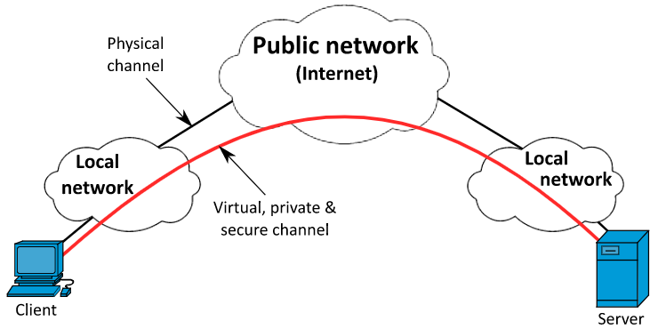

#### 3. WPA2 (Wi-Fi Protected Access 2):
Benyttes av **lenkelaget (Ethernet & Wifi)**, det brukes etter både TLS og VPN når en datamaskin sender ut data. Brukes for å la enheter komble seg til et tråløst nett, uten at inntrengere kan lure seg inn, og er **påbudt for alle nye wifi-enheter** Søttter bruk av temporary key integrity protocol (`TKIP`) og Counter Mode with Cipher Block Chaining Message Authentication Code Protocol (`CCMP`) for å sikre tråløs kommunikasjon.

CCMP er sikrere enn TKIP og skal teoretisk være uknekkelig, men har vist seg å ha svakheter som kunne benyttes.

Etter å ha vært gjennom lenkelaget, går nyttelasten videre til det fysiske laget for å overføres til en annen datamaskin, da har det kanskje blitt brukt kryptering med TLS, VPN og WPA2 for en sikker overføring.

## Hva er IP-nett?
samling av datamaskiner med en felles nettadresse. Datamaskiner på samme IP-nett kan sande pakker uten å gå via en ruter. Hvis den skal sendes til en annen IP-nett, sendes den gjennom ruteren. Dette blir adressert ved hjelp av en IP-adresse, som er en unik identifikator.

IP-adressen består av:
- Nett-id
- Host-id

Disse kan ikke leses direkte fra EP-en uten at man bruker en logisk **OG operasjon** på nettmasken og IP-adressen for å finne den. En adresse kan også deles inn i flere mindre nett (subnett), som gir firdeler som bla. reduserer broadkast trafikk fra mange enheter som forstyrrer hverandre og øker sikkerhet.

### Beskrivelse 
1. #### IP-Nett:
- **Nettverkslaget (IP):** Sørger for at hver pakke som skal sendes via rutes gjennom nettet.
- **Ruter:** Videresender pakker mellom ulike IP-nett gjennom ulike datanettverkene den er koblet opp med.

IP-nett er noe av det mest sentrale innen datakommunikasjon, alt av datatrafikk og sending av datapakker skjer over IP-nett og rutere. Ved at det er en samling av maskiner med lik nettadresse har de dermet lik nettmasker. Dette betyr også at de har samme kringkasningsdomene siden de befinner seg i samme nett-lag

 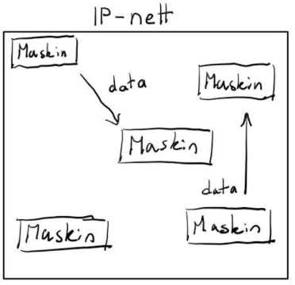


2. #### Hvordan fungerer IP-nettet:
- Når en datamaskin skal sende en pakke til en annen datamaskin, sjekker den først om mottakerens IP-adresse er i samme IP-nett ved å bruke nettmasken.
- Hvis mottakerens IP-adresse er i samme IP-nett, sender datamaskinen pakken direkte til mottakeren uten å gå gjennom en ruter.
- Hvis mottakerens IP-adresse er i et annet IP-nett, sender datamaskinen pakken til en ruter, som deretter videresender pakken til riktig IP-nettverk.

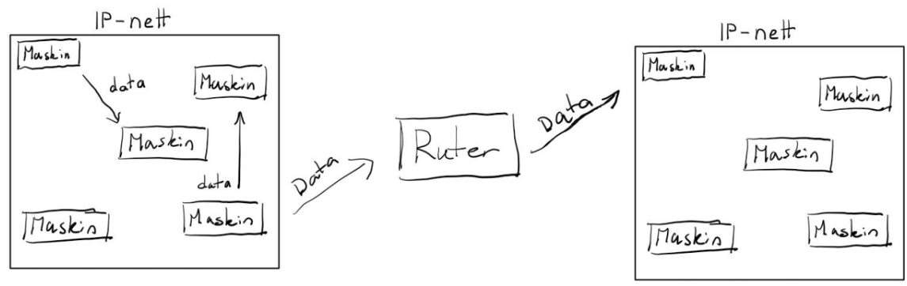

3. #### IP-adresse
- En IP-adresse er en **logisk adresse** (nettverkslaget) som identifiserer en enhet/et nettverkskort i et IP-nett, slik at pakker kan rutes til riktig mottaker.
- En enhet kan ha **flere IP-adresser samtidig** (f.eks. IPv4 + IPv6, og én per nettverksinterface som Wi‑Fi/Ethernet).
- IPv4 og IPv6 er to versjoner av IP: **IPv4 er 32-bit**, mens **IPv6 er 128-bit** (mye større adressrom).

| Type IP-adresse | Eksempel | Hva identifiserer den? | Hvor gjelder den? |
|---|---|---|---|
| Privat IPv4 (lokal) | 10.22.102.101 | Enheten din i et lokalt IP-nett (LAN) | Kun i private nett (ikke rutet på internett) |
| Offentlig IPv4 | 129.241.236.17 | Tilkoblingen ut mot internett (ofte ruteren/brannmuren – kan deles via NAT/CGNAT) | Globalt på internett |
| Loopback IPv4 | 127.0.0.1 | “Denne maskinen” (seg selv) | Kun lokalt på maskinen |
| Global IPv6 | 2001:700:300:4019:31eb:d741:f652:90bc | Enheten din med globalt routbar adresse | Globalt på internett |
| Link-local IPv6 | fe80::7bae:7a6d:1f49:f5dc | Enheten din på samme lokale lenke | Kun på samme lenke (samme Wi‑Fi/Ethernet), ikke rutet videre |
| Loopback IPv6 | ::1 | “Denne maskinen” (seg selv) | Kun lokalt på maskinen |

---

| Felt | Eksempel | Betyr |
|---|---|---|
| IPv4 adresse (host) | 10.22.102.101 | Adressen til enheten din i subnettet |
| Prefix (nettmaske) | /22 | Hvor mange bit som er nett-id (resten er host-id) |
| Nettadresse (network ID) | 10.22.100.0/22 | Adressen som representerer hele subnettet (nett-id) |
| Broadcast (IPv4) | 10.22.103.255 | “Send til alle” i subnettet (ofte filtrert/blokkert i moderne nett) |
| Gateway (ruter i subnettet) | 10.22.100.1 | Neste hopp ut av subnettet når du skal til andre IP-nett |

---

4. #### Nettmaske
...

5. #### Subnetting
...


| Del av IP-pakken | Hva det er | Eksempel / forklaring |
|---|---|---|
| Versjon | Hvilken IP-versjon som brukes | IPv4 eller IPv6 |
| Header-lengde | Hvor stor IP-headeren er | Forteller hvor nyttelasten begynner |
| Type of Service / DSCP | Prioritering av trafikk | Kan brukes for QoS |
| Total lengde | Hele størrelsen på IP-pakken | Header + nyttelast |
| Identifikasjon | Brukes ved fragmentering | Hjelper med å sette sammen pakker igjen |
| Flagg | Kontrollfelt for fragmentering | F.eks. om pakken kan deles opp |
| Fragment offset | Viser plassering av fragment | Brukes hvis pakken er delt opp |
| TTL (Time To Live) | Hvor mange rutere pakken kan passere | Reduseres med 1 for hvert hopp |
| Protokoll | Hvilken protokoll som ligger inni IP-pakken | TCP, UDP, ICMP |
| Header checksum | Feilsjekk av headeren | Sjekker at headeren ikke er ødelagt |
| Kilde-IP | Avsenderens IP-adresse | F.eks. 10.22.102.101 |
| Destinasjons-IP | Mottakerens IP-adresse | F.eks. 8.8.8.8 |
| Options | Ekstra valgfrie felt | Brukes sjelden |
| Nyttelast (payload) | Selve dataen som sendes videre | F.eks. en TCP-pakke med HTTP-data |

## Pakkesvitjing
Pakkesvitsjing er en metode for å sende data i små biter (pakker) over et nettverk. Hver pakke inneholder både data og informasjon om hvor den skal, og kan rutes uavhengig av andre pakker.

For å sikre at alt er blitt sendt, bruker man **Sjekksum** for å sjekke at dataen ikke har blitt ødelagt underveis. Hvis en pakke blir ødelagt, kan den bli sendt på nytt.

# Applikasjonslaget

## Web

### HTTP
Protokoll for utveksling av meldinger mellom klient og tjener. Programmet (nettleser) sender forespørsel om tilgang til webressurs.

En HTTP-forespørsel består av:
- Forespørselslinje: Metode (GET, POST, etc.) + URL + HTTP-versjon
- Header: Nøkkel-verdi par med metadata (f.eks. User-Agent, Accept)
- Tom linje
- Valgfri kropp (for POST/PUT)

#### 1. Hva er HTTP?
HTTP (Hypertext Transfer Protocol) er en protokoll som spesifiserer hvordan meldinger skal bli utvekslet mellom klient og tjener i en webtjeneste. Kan også deles opp i forespørsler og svar som har hver sitt meldingsformat.

#### 2. Flyten
For det meste sender flient forespøssel til tjener, og tjener svarer tilbake. Kommunikasjon består av 3 hoveddeler:
- TCP-kobling etableres.
- HTTP-forespørsel sendes (GET, POST, etc.)
- Svaret blir sendt fra tjener.

#### 3. Forespørsel
En forespørsel esstår av tre hoveddeler:
- En forespørselslinje
- Diverse headerlinjer
- En kropp med data (valgfri)

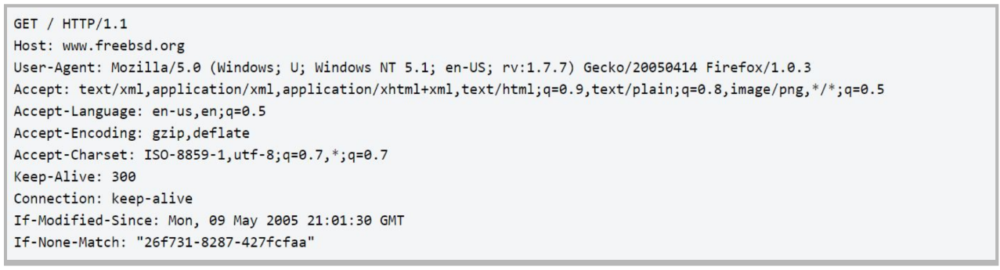

#### 4. Svar
Svar består av 3 hoveddeler:
- En statuslinje
- Diverse headerlinjer
- En kropp med data (valgfri)

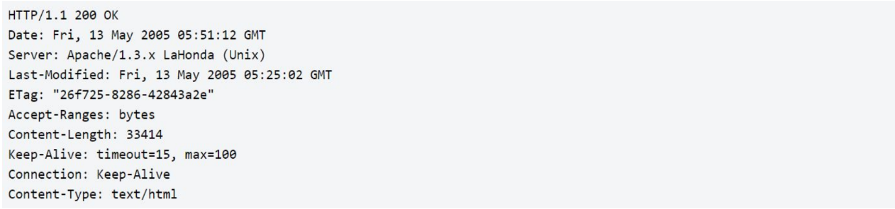

### HTTP-versjoner

#### 1. HTTP/0.9 - Enlinjeprotokoll
- En svært enkel versjon av HTTP som kun støttet GET-metoden og returnerte ren HTML uten header-informasjon.

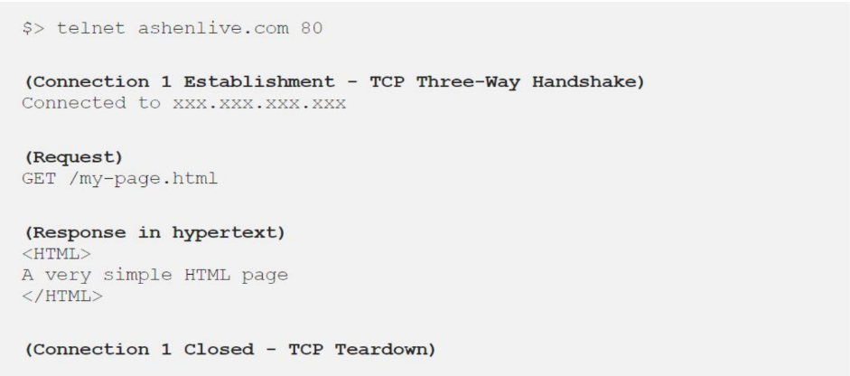

#### 2. HTTP/1.0 - Fleksiebelog utvidbar
- Støttet flere metoder (GET, POST, HEAD) og inkluderte header-informasjon i både forespørsler og svar. Hver forespørsel krevde en ny TCP-kobling, noe som førte til ineffektivitet.

#### 3. HTTP/1.1 - Den standariserte protokollen
- Introducerte vedvarende tilkoblinger, slik at flere forespørsler kunne sendes over samme TCP-kobling, noe som forbedret effektiviteten.

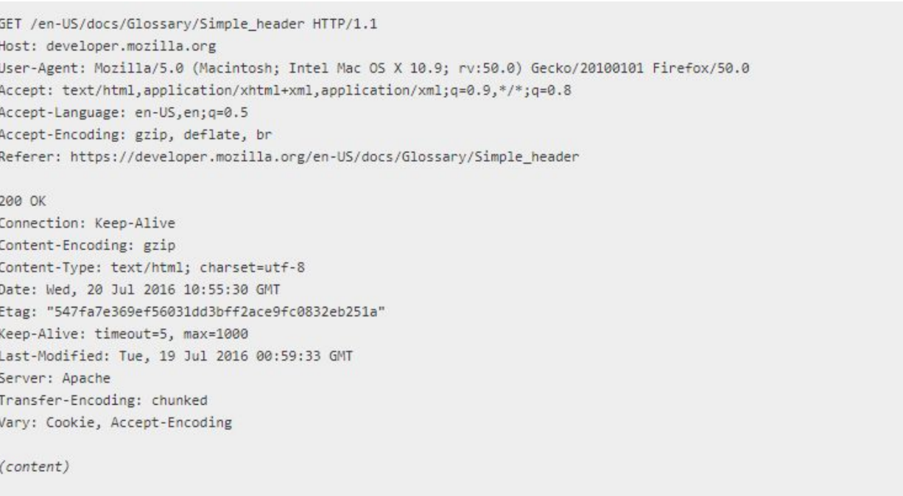

#### 4. HTTP/2
For å kunne benytte HTTP/2 må SSL (etterfølgeren til TLS) bli obligatorisk, det betyr at det må bli en del endringer iettverksarkutekturen hvis man skal flytte over til dertte for å utnytte ytelsesfordelene.


### HTTP Connection
Hvilken metode brukt for å hente informasjon. Pipelining effektiviserer bruker av vedvarende forbindelse vet at man kan sende flere requsets av gangen uten å vente på response. Det kan også opprettes flere forbindelser parrallelt som gjør det mulig å laste ned flere dokumenter samtldlig. Uendrede responser kan bli lagret på nettside så man slipper å hendetee fra server senete. (Sjekker om det er endret eller ikke)

Dette inkluderer at man kan gjøre en keep-alive, som holder forbindelsen åpen for flere forespørsler, og pipelining, som lar klienten sende flere forespørsler uten å vente på svar. Dette forbedrer ytelsen ved å redusere overheaden ved å etablere nye TCP-koblinger for hver forespørsel.

### HTTP Cookie
En cookie på norsk er informasjonskaples. Det blir gjort av en header i HTTP-svaret `Set-Cookie: cookie_name=cookie_value; Expires=Wed, 09 Jun 2021 10:18:14 GMT; Path=/; Domain=example.com; Secure; HttpOnly`. Det er en liten tekstfil som lagres på klienten (nettleseren) og sendes tilbake til serveren ved hver forespørsel til samme domene. Cookies brukes for å lagre informasjon om brukerens sesjon, preferanser eller annen data som serveren trenger for å gi en bedre brukeropplevelse.

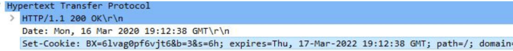

Klient og tjener lagrer cookie id, og når klienten sender en forespørsel til tjeneren, sendes cookie id tilbake i headeren `Cookie: cookie_name=cookie_value`. Tjeneren kan da bruke denne informasjonen for å gjenkjenne brukeren og gi en mer personlig opplevelse, som å huske innloggingsstatus eller preferanser.

Dataen er lagret hos klienten, og det er opp til tjeneren å bestemme hva som skal lagres i cookie og hvordan det skal brukes. Det er viktig å være oppmerksom på sikkerhetsaspekter ved bruk av cookies, som å unngå å lagre sensitiv informasjon og bruke sikre flagg for å beskytte mot angrep som cross-site scripting (XSS).

#### Typer
- **Session cookies**: Midlertidige cookies som slettes når nettleseren lukkes. Brukes ofte for å holde styr på brukerens sesjon.
- **Persistent cookies**: Cookies som lagres på klienten i en bestemt periode, selv etter at nettleseren er lukket. Brukes for å huske brukerpreferanser eller innloggingsstatus over tid.
- **Secure cookies**: Cookies som kun sendes over sikre forbindelser (HTTPS). Brukes for å beskytte sensitive data.
- **HttpOnly cookies**: Cookies som ikke er tilgjengelige for JavaScript, og dermed beskytter mot visse typer angrep som cross-site scripting (XSS).

### HTTP If-Modified-Since
En HTTP-header som brukes av klienten for å be tjeneren om å sende data bare hvis det har blitt endret siden en bestemt dato og tid. Dette brukes for å optimalisere nettverkstrafikken ved å unngå å sende data som allerede er lagret i klientens cache.

`Status Code: 304 Not Modified` indikerer at dataen ikke har blitt endret siden den siste forespørselen, og klienten kan bruke den lagrede versjonen i cache uten å laste ned dataen på nytt.

`Status Code: 200 OK` indikerer at dataen har blitt endret, og tjeneren sender den oppdaterte dataen tilbake til klienten.

I requesten så er det også lagret en dato og tid for når dataen sist ble endret, og tjeneren sammenligner dette med den siste endringen for å avgjøre om dataen skal sendes på nytt eller ikke. Dette bidrar til å redusere unødvendig nettverkstrafikk og forbedre ytelsen ved å bruke cache effektivt.

### HTTP Host
HTTP header `Host`. Formål er at det skal fortelle mottaker hvilket domenenavn det skal benytte til å søke etter den etterspurte ressursen som er oppgitt. På denne måten kan man ha flere domenenavn på samme IP-adresse.

IP-adressen sender forespørselen til riktig server, mens Host-headeren forteller hvilket nettsted på serveren klienten vil nå.

## DNS

### Domener & Domenenavn
Brukes til ulike typer tjenester, deriblant web og epost. Den søker opp nettsider. Istedet for å huske IP-adresser, bruker vi domenenavn som er lettere å huske. DNS (Domain Name System). En del av applikasjonslaget som oversetter domenenavn til IP-adresser, kan se på det som en type Dictionary<String, IPAddress>. Eller en oppslagstabell som kobler domenenavn til IP-adresser.

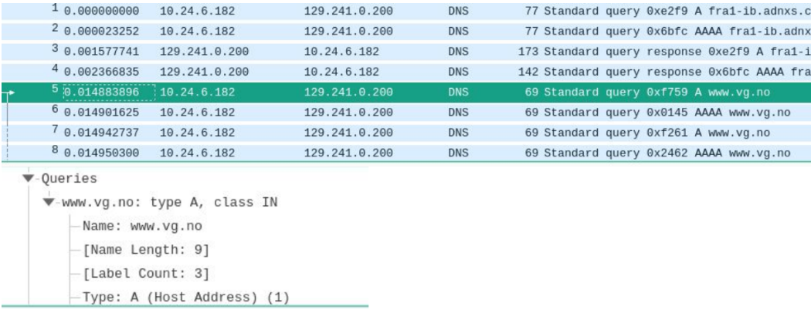

#### Oppbygning
| Nivå | Eksempel | Beskrivelse |
|---|---|---|
| root *Rotnivå* | . | Det øverste nivået i DNS-hierarkiet, representert av en punktum (.) |
| TLD (Top-Level Domain) *Toppnivå* | .com, .org, .net, .no | Det neste nivået under root, som representerer kategorier av domener |
| SLD (Second-Level Domain) *Domene* | google, wikipedia, ntnu | Det nivået | 
| ENGLISH (soemething) *Sumdommene* | www, mail, blog | Det nivået under SLD, som kan brukes til å organisere tjenester eller avdelinger innen et domene |

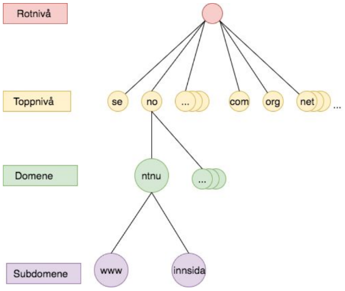

#### Adnimistrasjon av domener
Mange organisasjoner, men det overordnede ansvaret ligger hos ICANN, .no ligger under Norid, og så videre. Så kommer subdomener som NTNU, og så videre. Det er en hierarkisk struktur for administrasjon av domener.

### Navntjenere
navnetjener er den daamaskin som har fast tilkombling tl internett som oversetter domenenavn til ip-adresser og andre veien. Slik som en dictionary i c#. 

**Når navnetjeneren ikke har svaret** så må den spørre andre navnetjenere, og det kan være flere ledd i denne prosessen, men til slutt vil den finne svaret og sende det tilbake til klienten.

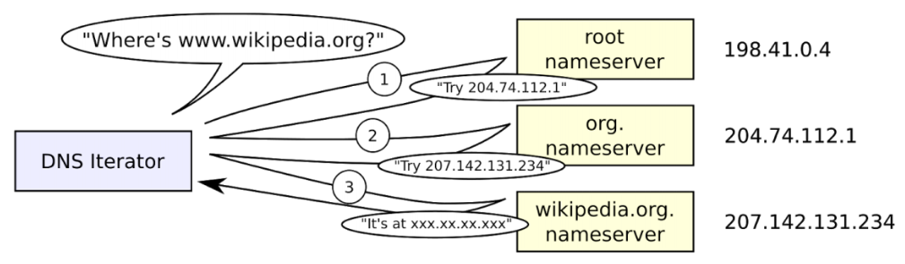
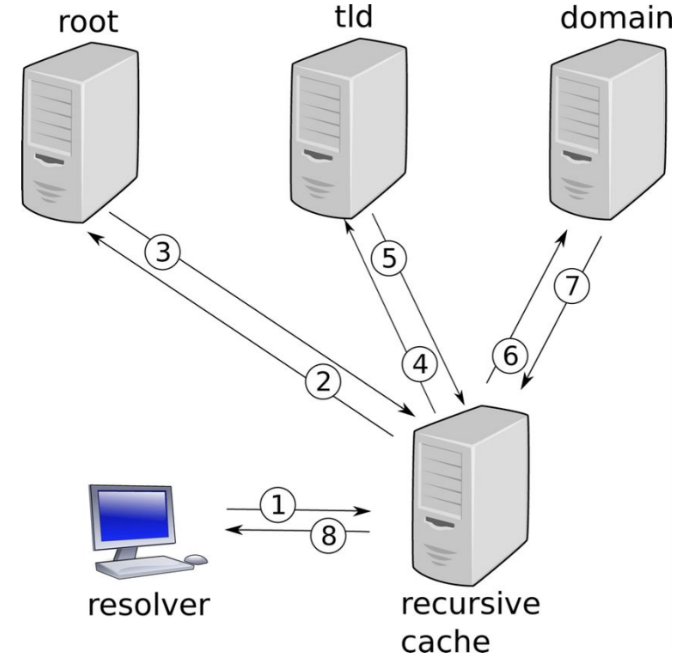

Tabelleksempel på navnetjener-hierarkiet for URL-en `http://www.idi.ntnu.no/page`

| Del | Type | Forklaring |
|---|---|---|
| `http://` | Protokoll | Angir hvilken protokoll som brukes, ikke en del av DNS |
| `www.idi.ntnu.no` | Vertsnavn | Domenenavnet som skal slås opp i DNS |
| `www` | Subdomene/vertsnavn | En bestemt tjeneste eller maskin under `idi.ntnu.no` |
| `idi` | Subdomene | Underdomene under `ntnu.no` |
| `ntnu` | Domenenavn | Organisasjonens domene under `.no` |
| `no` | Toppdomene (TLD) | Nasjonalt toppdomene for Norge |
| `/page` | Sti/path | Ressurs på webserveren, ikke en del av DNS |

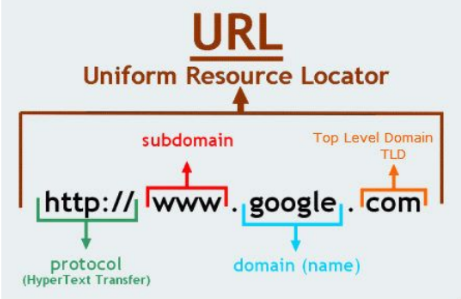

Domenene er strukturert fra slutt til start:

`root -> .no -> .ntnu -> .idi -> .www`
www er heller ikke obligatorisk.

Det lagres lokalt i cache når en navnetjener har slått opp et domenenavn, slik at fremtidige forespørsler kan besvares raskere uten å måtte kontakte andre navnetjenere.

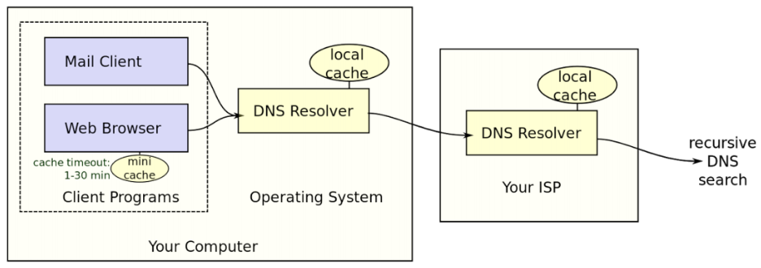
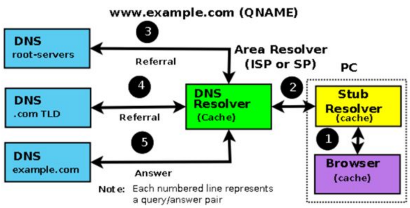

### DNS Ressurs Record
Også kalt RR, er informasjonen knyttet til et domenenavn i DNS databasen. RR returnerer svar på spørringer fra DNS-klienter. Styrt av IETF.

De mest brukte rekordene er `A` og `AAAA`, som er: 
- Dictionary<String, IPAddress>
- A: IPv4
- AAAA: IPv6

| Type | Betyr | Inneholder | Eksempel |
|---|---|---|---|
| A | Address | IPv4-adresse | `196.168.1.31` |
| AAAA | IPv6 Address | IPv6-adresse | `2001:db8::1` |
| NS | Name Server | Navnetjener for et domene | `ns1.ntnu.no` |
| CNAME | Canonicl Name | Det egentlige domenenavnet når et navn er et alias | `pc1.example.com` |
| PTR | Pointer | Domenenavn ved reversoppslag fra IP-adresse | `pc1.example.com` |
| MX | Mail Exchanger | Navn og prioritet på e-posttjener for domenet | `10 mail.example.com` |

`ns1` står for nameserver 1, og det kan være flere navnetjenere for et domene for redundans og lastbalansering. `10` i MX-recorden er en prioritet, der lavere tall har høyere prioritet. Hvis det er flere MX-records, vil e-post bli sendt til den med høyest prioritet først. `pc1` står for en bestemt maskin eller tjeneste under domenet `example.com`.

### DNS Reversoppslag
Reversoppslag i DNS er prosessen med å finne domenenavnet som er knyttet til en gitt IP-adresse. Dette gjøres ved å bruke en spesiell type DNS-record kalt PTR (Pointer Record). Reversoppslag brukes ofte for feilsøking, logging og sikkerhetsformål, for å identifisere hvilken maskin eller tjeneste som er knyttet til en bestemt IP-adresse.

`dig -x 8.8.8.8` -> `dns.google.`

PTR-records brukes bla av e-post tjenester for å sjekke at avsenderens IP-adresse stemmer overens med PTR-recorden for IP-adAdres. Hvis ikke så kan epposttjeneren forkaste. Dette kan hjelpe mot phishing og spamming.

## Mail

### SMTP
SMTP (Simple Mail Transfer Protocol) er en protokoll som brukes for å sende e-post mellom e-postklienter og e-postservere, samt mellom e-postservere. Det er også Extended SMTP som kom for å for å sende  andre data som filer osv (ESMTP).

For å sende epost, må man utføre disse tre komandoene i rekkefølge: 
- MAIL
- RCPT
- DATA

#### Initialisering
1. Etablere kobling mellom seg og server
2. Klient sender `HELO` eller `EHLO` for å identifisere seg selv til serveren
3. Serveren svarer med en velkomstmelding og eventuelle støttede funksjoner
4. Klienten sender `MAIL FROM` for å spesifisere avsenderens e-postadresse
5. Serveren svarer med en bekreftelse
6. Klienten sender `RCPT TO` for å spesifisere mottakerens e-postadresse
7. Serveren svarer med en bekreftelse eller en feilmelding
8. Klienten sender `DATA` for å indikere at den er klar til å sende e-postens innhold
9. Serveren svarer med en bekreftelse, og klienten sender e-postens innhold, avsluttet med en linje som inneholder bare en punktum (`.`)
10. Serveren svarer med en bekreftelse på at e-posten er mottatt og vil bli levert

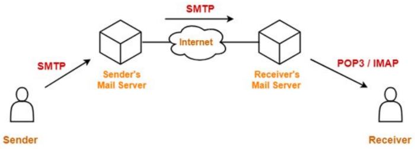

#### MAIL
***Avsenderens e-postadresse***

Et eksempel på en MAIL-kommando er slik:

```
MAIL FROM:<reverse-path> [SP <mail-parameters> ] <CRLF>
MAIL FROM: <test@test.no>
```

`<reverse-path>` er e-postadressen til avsenderen, og `<mail-parameters>` kan inkludere ekstra informasjon som prioritet eller tidsstempel. Kommandoen må avsluttes med en linjeskift (`<CRLF>`).

Hvis kommando aksepteres, vil serveren svare med en statuskode som indikerer at kommandoen er vellykket, for eksempel `250 OK`. Hvis det oppstår en feil, kan serveren svare med en annen statuskode, for eksempel `550 No such user` hvis avsenderadressen ikke er gyldig.

Kan bruke `telnet` for å teste SMTP-serveren ved å koble til port 25 og sende kommandoer manuelt.

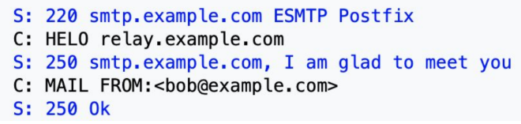

#### RCPT
***Mottakerens e-postadresse***

Et eksempel på en RCPT-kommando er slik:
```
RCPT TO:<forward-path> [SP <rcpt-parameters> ] <CRLF>
RCPT TO: <test@test.no>
```

`<forward-path>` er e-postadressen til mottakeren, og `<rcpt-parameters>` kan inkludere ekstra informasjon som prioritet eller tidsstempel. Kommandoen må avsluttes med en linjeskift (`<CRLF>`).

Hvis kommando aksepteres, vil serveren svare med en statuskode som indikerer at kommandoen er vellykket, for eksempel `250 OK`. Hvis det oppstår en feil, kan serveren svare med en annen statuskode, for eksempel `550 No such user` hvis mottakeradressen ikke er gyldig.

#### DATA
***E-postens innhold***

Et eksempel på en DATA-kommando er slik:
```DATA <CRLF>
Subject: Test Email
This is a test email sent using SMTP.
.<CRLF>
```

Kommandoen `DATA` indikerer at klienten er klar til å sende e-postens innhold. Etter å ha sendt `DATA`, må klienten sende e-postens innhold, og avslutte det med en linje som inneholder bare en punktum (`.`) etterfulgt av en linjeskift (`<CRLF>`).

#### Avsluttning
***Avslutte SMTP-sesjonen***

Når en SMTP-sesjon er ferdig, kan klienten sende `QUIT`-kommandoen for å avslutte forbindelsen med serveren. Serveren vil svare med en bekreftelse, og deretter lukkes forbindelsen.

```
QUIT <CRLF>
```

### MIME
MIME (Multipurpose Internet Mail Extensions) er en standard som utvider formatet for e-post for å støtte ikke-tekstlig innhold, som bilder, videoer og vedlegg. Det gjør det mulig å sende e-post med rikere innhold enn bare ren tekst.

Dette gjøres ved å bruke spesielle header-felt i e-postmeldingen, som `Content-Type` og `Content-Disposition`, for å indikere typen innhold og hvordan det skal håndteres av e-postklienten. MIME gjør det også mulig å sende flere deler i en e-post, som for eksempel en tekstdel og en vedleggsdel, ved å bruke en struktur kalt multipart.

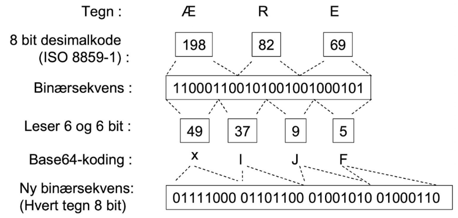