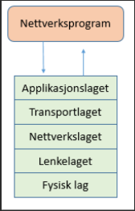
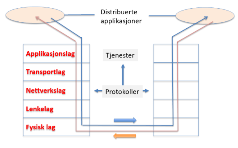
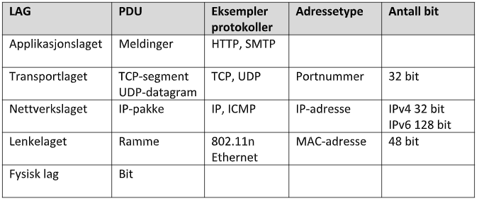
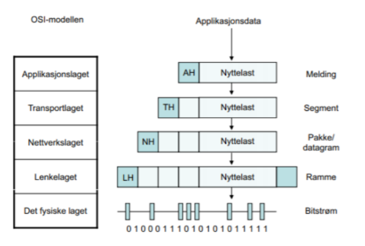
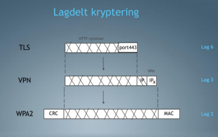

# [Datakom for ingeniører - Eksamensøving](https://sites.google.com/view/tdat2004-datakom/)

# **Lagmodellen**

- Basert på forenklede 5-lags OSI-modellen

```
Netverksprogram

<->

Applikasjonslaget
Transportlaget
Nettverkslaget
Lenkelaget
Fysisk lag
```



---

## Om Lagmodellen
- Utviklet for å dele opp en kompleks oppgave i separate deloppgaver, organisert i "lag".
- Modellen er utviklet av `ISO` og kalles Open Systems Interconnection (OSI) modellen.
- Andre standardiseringsorganisasjoner er `IETF`, `IEEE` og `W3C`.

*Det er flere utgaver av modellen, bla. 7-lags OSI-modellen og en TCO/IP-modell. Men vi benytter den forenklede modellen*

### Beskrivelse

1. #### Hovedprinsipper.
Systemutviklere har ansvar for å utvikle  i henhold til grensesnitt mot protokoller på applikasjonslaget. Prinsipper er at apps og protokoller kommuniserer med hverandre på likestilt nivå, men benytter tjenerter fra laget under for å overføre data mellom partene. Ved en slik approach kan man bytte ut en protokoll (eller blokk/modul) uten å påvirke andre deler av systemet. Hver blokk/modul er en tjeneste.



2. #### Oppagene for lagene.
- Applikasjonslaget: Grensesnitt mot distrubuerte applikasjoner. *Eksempler er HTTP, SMTP (e-post), FTP (filoverføring)*
- Transportlaget: Ende-ende overføring av meldinger. *Eksempler er TCP (Transport Control Protocol) og UDP (User Datagram Protocol)*
- Nettverkslaget: Sørger for at hver pakke rutes gjennom nettet. *Eksempler er IP (Internet Protocol) og ICMP (Internet Control Message Protocol)*
- Lenkelaget: Sørger for at pakkene overføres mellom to tilstøtende noder (mellom to nettverkskort). *Eksempler er Ethernet og Wi-Fi*
- Fysisk lag: Sender signaler over et transmisjonsmedium (luft, kopper, fiber). *Eksempler er elektriske signaler, optiske signaler og radiobølger.*

3. #### Pakkeenheter protocol data unit (`PDU`) og adressering.
PDU er en enkel **enhet** med informasjon som sendes mellom likestilte enheter i et datanettverk. Den består av protokoll-spesifikk informasjon (*pakkehodet*) og brukserdata (*nyttelast fra laget over*).



---

## Innpakkingsprinsippet
Innpakkingsprinsippet går ut på at når en pakke skal sendes så legges det til en ny pakkeheader på toppen av pakken for hvert lag pakken går igjennoom, som en pyramide. Pakken blir støyye for hvert lag, og når den kommer frem til mottaker så blir den avpakket igjen i motsatt rekkefølge.

### Beskrivelse
Netverk er delt inn i forskjellige lag, disse er helt separat fra hverandre, og er ikke interessert i hva laget under inneholder av informasjon, kun i hvordan data skal bli sendt videre til rett mottaker.



## Lagdelt Kryptering
Vil si at innholdet (nyttelast; dataen til laget over) på hvert enkel lag i OSI kan krypteres uavhengi av hva som skjer i andre lag. Da blkir feil av en enkeltstående beskyttelsesmekanisme ikke føre til  at det helgetlige systemet bliur stående uten forsvarsverker (uten beskyttelse).

De tre sikkerhetsmekanismekle som bruker i lagdelt struktur er `WPA2`, `TLS` og `VPN`, på forskjellige lag i OSI-modellen.
- `WPA2` - Lenkelaget: Ethernet og Wi-Fi
- `TLS` - Applikasjonslaget: HTTP, SMTP, FTP
- `VPN` - Nettverkslaget: IP



### Beskrivelse
Ved å bruke forskjellige krypteringsmetoder vil sensitiv informasjon sikres godt, noe som er viktig i dagens samfunn. Alt blir kryptert uavheingige med hverandre i henhold til lag, dersom et lag feilereller noen klarer å bryte det, er det fortsatt flere lag med kryptering igenn.

#### 1. TLS (Transport Layer Security):
HTTP***S*** er kryptert versjon av HTTP som benytter TLS for sikker transport. Og ligger i lagene Applikasjonslaget og Transportlaget. TLS sørger for at data som sendes mellom klient og server er kryptert og beskyttet mot avlytting og manipulering.


